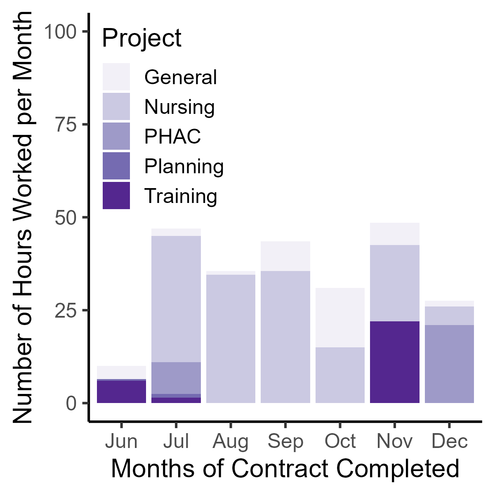
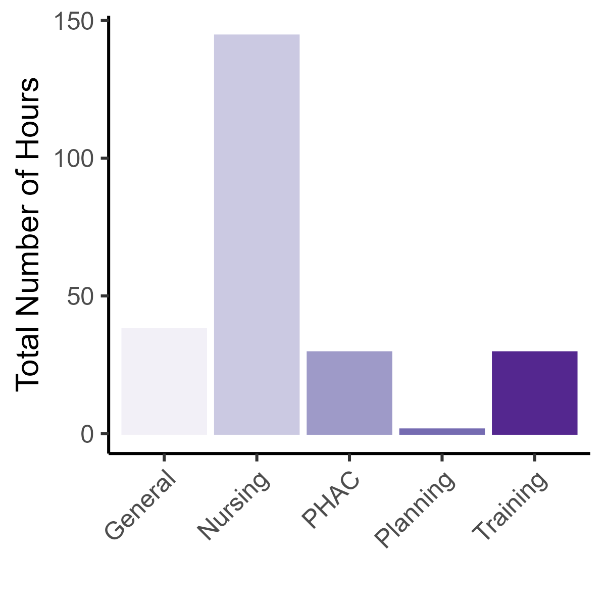
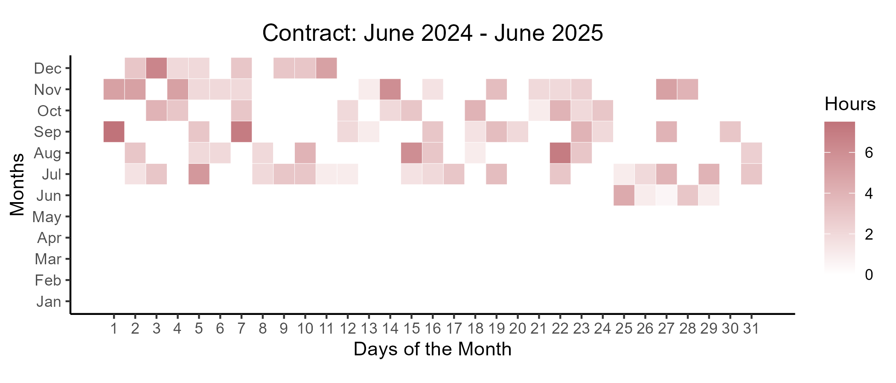

```{r setup, include=FALSE}
library(flexdashboard)
library(tidyverse)
library(reshape2)
library(lubridate)
library(viridis) 
library(calendR)
library(RColorBrewer)

data <- read_csv("JLB_time.csv")
data$Date <- as.Date(data$Date, format = "%m/%d/%Y")

data$Project[is.na(data$Project)] <- ""
data$Hours[is.na(data$Hours)] <- 0
```

*The purpose of this dashboard is to track my time working as a research associate in the McIntyre lab*.

Current Week
=======================================================================

Column {data-width=250}
-----------------------------------------------------------------------

### Hours Worked This Week 

```{r}
data$Weeks <- lubridate::week(data$Date)

a <- lubridate::week(Sys.Date())

b <- data[data$Weeks == a, ]

c <- b %>%
  na.omit() %>%
  summarise(
    sum=sum(Hours)
  )

ggplot()+
  ylim(0,1)+
  xlim(0,1)+
  annotate("text",x=0.5,y=0.5,label=c,size=35,colour="#6a51a3")+
  theme_void()
```

### Distribution of Time by Project This week 

```{r}
data$Weeks <- lubridate::week(data$Date)

a <- lubridate::week(Sys.Date())

b <- data[data$Weeks == a, ]

b %>%
  na.omit() %>%
  ggplot(aes(x=Date,y=Hours,colour=Project,fill=Project))+
  geom_bar(stat="identity")+
  scale_color_brewer(palette = "Purples")+
  scale_fill_brewer(palette = "Purples")+
  theme_classic()+
  labs(
    y="Number of Hours"
  )+
  ylim(0,10)
```

Column {data-width=350}
-----------------------------------------------------------------------

### Specific Tasks This week

```{r}
data$Weeks <- lubridate::week(data$Date)

a <- lubridate::week(Sys.Date())

b <- data[data$Weeks == a, ]

b$day_of_week <- weekdays(b$Date)

b %>%
  na.omit() %>%
  group_by(Project) %>%
  select(Date,day_of_week,Project,Description,Hours) %>%
  knitr::kable()
```

All Historical Data
=======================================================================

Aggregate Data Across Entire Work Term {data-width=250}
-----------------------------------------------------------------------

### Distribution of Time by Project Across Months 

```{r}
a <- data %>%
  na.omit() %>%
  mutate(month = lubridate::month(Date,abbr = TRUE,label=TRUE)) %>% 
  group_by(month,Project) %>%
  summarise(Hours = sum(Hours)) %>%
  ggplot(aes(month,Hours,fill=Project))+
  geom_col()+
  scale_color_brewer(palette = "Purples")+
  scale_fill_brewer(palette = "Purples")+
  theme_classic()+
  theme(legend.position = c(0,1),legend.justification = c(0,1))+
  labs(
    x="",
    y="Number of Hours Worked per Month"
  )

ggsave("Proj_months.png",a,height=4,width=4,dpi=300)

```

### Total Amount of Time Spent on Each Project

```{r}
a <- data %>%
  na.omit() %>%
  group_by(Project) %>%
  summarise(
    Hours = sum(Hours)
  ) %>%
  ggplot(aes(x=Project,y=Hours,colour=Project,fill=Project))+
  geom_bar(stat="identity")+
  scale_color_brewer(palette = "Purples")+
  scale_fill_brewer(palette = "Purples")+
  theme_classic()+
  theme(legend.position="none")+
  theme(axis.text.x = element_text(angle = 45, vjust = 0.5, hjust=1))+
  labs(
    y="Total Number of Hours",
    x=""
  )

ggsave("total_time.png",a,height=4,width=4,dpi=300)

```

Column {data-width=350}
-----------------------------------------------------------------------

### Heatmap of Hours Worked Across Days of Established Contract

```{r}
a <- data %>%
  select(c("Date","Hours"))

b <- data.frame(
  Date = seq(as.Date("2024-06-24"), as.Date("2025-06-24"), by="days")
)

c <- left_join(b,a,by="Date") %>%
  group_by(Date) %>%
  summarise(
    Hours=sum(Hours)
  )%>%
  mutate(Month = lubridate::month(Date,abb=TRUE,label=TRUE),
         Day = lubridate::day(Date))

c$Hours[is.na(c$Hours)] <- 0

d <- c %>%
  ggplot(aes(x=Day,y=Month,fill=Hours))+
  geom_tile(colour="white")+
  scale_fill_gradient(low="white",high="#C0737A")+
  coord_fixed()+
  theme_classic()+
  theme(plot.title = element_text(hjust=0.5))+
  labs(
    x="Days of the Month",y="Months",colour=NULL, title="Contract: June 2024 - June 2025"
  )+
  scale_x_continuous(breaks = c(1:31))

ggsave("heatmap.png",d,height=3,width=7,dpi=300)

```

### All Historical Specific Tasks & Hours 

```{r}
data %>%
  na.omit() %>%
  arrange(desc(Date)) %>%
  select(Date,Project,Description,Hours) %>%
  knitr::kable()
```

Project Timelines
=====================================================================

### Nursing & Spasticity Project

```{r}
data <- read_csv("Nursing_timeline.csv")

a <- data  %>%
  melt(id.vars=c("Activity","Order","Done")) %>%
  mutate(value = as.Date(value),Order = as.factor(Order)) %>%
  ggplot(aes(x=Activity,y=value,colour=Done))+
  geom_line(size=5,alpha=0.2)+
  theme_classic()+
  theme(plot.title = element_text(hjust=0.5))+
  theme(legend.position = c(1,0),legend.justification = c(1,0))+
  theme(plot.background=element_rect(fill="transparent",colour="transparent"))+
  theme(panel.background=element_rect(fill="transparent",colour="transparent"))+
  theme(legend.background = element_rect(fill="transparent",colour="transparent"))+
  labs(x="",y="",colour=NULL)+
  coord_flip()+
  aes(x = fct_inorder(Order))+
  scale_x_discrete(labels=data$Activity)+
  labs(x="",title = "Nursing & Spasticity Project")

today <- as.Date(Sys.Date())

GANTT <- a +
  annotate("segment",x=1,xend=8,y=today,yend=today,linetype="dashed",alpha=0.5)+
  annotate("text",x=6,y=today,label="Today's Date",size=3)

GANTT
```

### PHAC Project

```{r}
data <- read_csv("PHAC_timeline.csv")

a <- data  %>%
  na.omit() %>%
  melt(id.vars=c("Activity","Order","Done")) %>%
  mutate(value = as.Date(value),Order = as.factor(Order)) %>%
  ggplot(aes(x=Activity,y=value,colour=Done))+
  geom_line(size=5,alpha=0.2)+
  theme_classic()+
  theme(plot.title = element_text(hjust=0.5))+
  theme(legend.position = c(0,1),legend.justification = c(0,1))+
  theme(plot.background=element_rect(fill="transparent",colour="transparent"))+
  theme(panel.background=element_rect(fill="transparent",colour="transparent"))+
  theme(legend.background = element_rect(fill="transparent",colour="transparent"))+
  labs(x="",y="",colour=NULL)+
  coord_flip()+
  aes(x = fct_inorder(Order))+
  scale_x_discrete(labels=data$Activity)+
  labs(x="",title = "PHAC Project")+
  ylim(as.Date("2024-06-01"), as.Date("2025-04-01"))

today <- as.Date(Sys.Date())
Complete <- as.Date("2025-03-01")

GANTT <- a +
  annotate("segment",x=1,xend=5,y=today,yend=today,linetype="dashed",alpha=0.5)+
  annotate("text",x=3.5,y=today,label="Today's Date",size=3)+
  
  annotate("segment",x=1,xend=5,y=Complete,yend=Complete,linetype="dashed",alpha=0.5,colour="red")+
  annotate("text",x=3.5,y=Complete,label="Complete PHAC \n Project",colour="red",size=3)

GANTT
```


